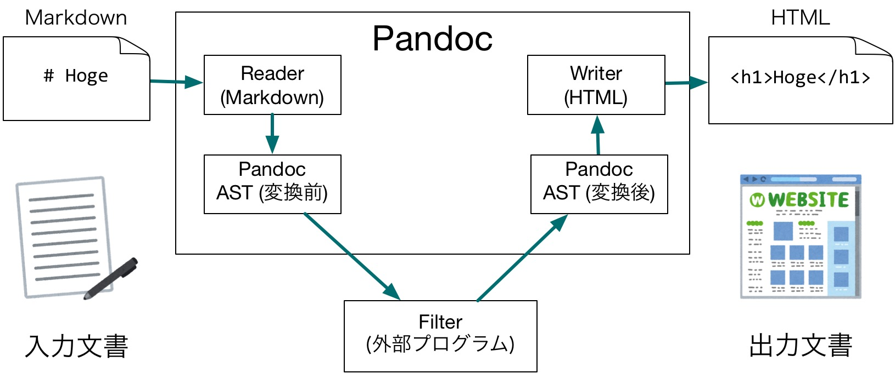

---
title: Pandocチュートリアル 第2回 HaskellでPandocフィルタを実装しよう
author: 藤原 惟 / すかいゆき (@sky\_y)
date: 2017年2月17日
revealjs-url: reveal.js-3.4.0
theme: sky-sky-y
transition: fade
transitionSpeed: fast
slideNumber: true
margin: 0
history: true
center: true
...

----

# 自己紹介 {#self-intro}

- 名前
    - 藤原 惟
    - すかいゆき ([\@sky\_y](https://twitter.com/sky_y))
    - Yuki Fujiwara （本名）
- 職業
    - フリープログラマ
    - 専門学校 非常勤講師

----

# Pandocに関する活動 {#pandoc-activity}

- Qiitaを中心に記事執筆
    - [多様なフォーマットに対応！ドキュメント変換ツールPandocを知ろう - Qiita](http://qiita.com/sky_y/items/80bcd0f353ef5b8980ee)
- Pandocユーザーズガイドを和訳
    - [Pandoc ユーザーズガイド 日本語版](http://sky-y.github.io/site-pandoc-jp/users-guide/)
    - バージョンが古くなったので、改訂を予定

----

# 発表を始めます {#begin-presentation}

----

# このチュートリアルでやること（2回分の概要） {#tutorial-overview}

- 第1回（今回） Pandocでドキュメントを変換しよう
    - Pandocをツールとして使う（入門編、第2回の基礎知識）
- **第2回 HaskellでPandocを拡張してみよう** （←いまここ）
    - Haskellのやさしい入門（を目指します）
    - 「日常的な実用言語」としてのHaskellを体験してもらいたい
    - Pandocのソースコードも少し読みます

----

# Pandoc公式サイト {#pandoc-official}

- [Pandoc - About pandoc](http://pandoc.org/index.html)
- ユーザーズガイド
    - [Pandoc - Pandoc User’s Guide](http://pandoc.org/MANUAL.html)
    - [Pandoc ユーザーズガイド 日本語版](http://sky-y.github.io/site-pandoc-jp/users-guide/)

----

# Pandocとは（第1回の短いおさらい） {#head-pandoc-in-short}

----

# Pandocとは {#pandoc-is-this}

- [Pandoc - About pandoc](http://pandoc.org/index.html)
- 文書変換ツール
    - あるフォーマットで書かれた文書を、別のフォーマットに変換するツール
- Pandocの特徴は、対応フォーマットが非常に多いこと

----

# {#pandoc-flow}


----

# {#the-pandoc-diagram}

[{ width=15% }](http://pandoc.org/diagram.jpg)

----

# Pandoc実装の概要 {#pandoc-impl}

- 言語: Haskell
    - Pandoc的には、「厳密に型が定義されている」ことがありがたい
    - Haskellは構文解析器(パーサ)を作るのにすごく適している (Parsecなど)
- モジュール構成
    - Reader: 入力文書を解析し、Haskell上の中間文書に変換する
    - Writer: 中間文書を受け取り、出力フォーマットに変換する

----

# {#pandoc-flow2}


----

# Pandocをインストールする {#pandoc-install}

- ターミナル(Mac/Linux)またはコマンドプロンプト(Windows)
- パッケージを直接落としてインストール
    - [Pandoc ダウンロードページ](https://github.com/jgm/pandoc/releases/latest)
        - Windows: `.msi`, Mac: `.pkg`
- パッケージマネージャでインストール
    - Mac([Homebrew](http://brew.sh/index_ja.html)): `$ brew install pandoc`
    - Windows([Chocolatey](https://chocolatey.org/)): `> cinst pandoc`
    - Linux(Debian): `$ sudo apt-get install pandoc`

----

# wkhtmltopdfのインストール {#install-wkhtmltopdf}

- PDF出力のために必要（おすすめ）
- パッケージを直接落としてインストール
    1. [ここからパッケージをダウンロード](http://wkhtmltopdf.org/downloads.html)
        - Windowsは未検証ですが、MinGWの方を試してみてください
    2. インストール
- パッケージマネージャでインストール
    - Mac: `$ brew cask install wkhtmltopdf`
        - Caskの方なので注意

----

# Pandocで遊ぶ {#try-pandoc}

```
$ pandoc --version
$ echo "**Hello**" | pandoc -f markdown -t html
<p><strong>Hello</strong></p>
$ echo "**Hello**" | pandoc -f markdown -t html5 -o hello.pdf
（PDFが生成される）
```

----

# PandocのFilterとは {#head-pandoc-filter}

----

# PandocのFilterとは {#pandoc-filter}

- ReaderとWriterの間で処理を行う外部プログラム
    - Unix/コマンドプロンプトのパイプを使って書ける
    - JSON形式の文書(JSON AST)でやり取りする
        - Haskell以外の言語でも実装可能

----

# {#pandoc-flow3}



----

# Filter: コマンドでいえば {#pandoc-filter-command}

```
pandoc --filter ./hoge.py -t latex
```

と

```
pandoc -t json | ./hoge.py latex | pandoc -f json -t latex
```

は等価

----

# Filterを動かしてみよう {#run-filter}

- [公式サンプル](https://github.com/jgm/pandocfilters/tree/master/examples)から「[caps.py](https://github.com/jgm/pandocfilters/blob/master/examples/caps.py)」を動かしてみる。
    - Pythonのpipを使用。環境がない人はデモだけ見て下さい

```
$ sudo pip install pandocfilters
$ curl -O https://raw.githubusercontent.com/jgm/pandocfilters/master/examples/caps.py
$ echo 'abc' | pandoc --filter ./caps.py -t html
<p>ABC</p>
```

----

# caps.py の実装 {#impl-of-capspy}

```python
from pandocfilters import toJSONFilter, Str

def caps(key, value, format, meta):
    if key == 'Str':
        return Str(value.upper())

if __name__ == "__main__":
    toJSONFilter(caps)
```

----

# Filterを実装する手順 {#how-to-impl-filter}

- PandocのJSON ASTを読み込めるライブラリを使う
    - 参考: [Pandoc Filters · jgm/pandoc Wiki](https://github.com/jgm/pandoc/wiki/Pandoc-Filters)
- 次の仕様を満たす関数を実装し、`toJSONFilter`の引数に与える
    - 引数を使い、変換前のJSON ASTを受け取る
    - JSON ASTを変換（要素を追加・変更・削除）する
    - 変換後のJSON ASTを返す
- 補足: `toJSONFilter`が、標準入力・標準出力を通じたJSON ASTのやりとりを代理してくれる

----

# PandocのASTを知る {#head-learning-ast}

----

# PandocのASTを知る {#learning-ast}

- 厳密な仕様はここに載っています
    - [Text.Pandoc.Definition](https://hackage.haskell.org/package/pandoc-types-1.17.0.5/docs/Text-Pandoc-Definition.html)
    - 今回は割愛します（自分で実装したい際に参照してください）

----

# ASTは、厳密には2種類ある {#two-asts}

- JSON AST
    - ただのJSONなので、どの言語でも利用できる
    - 冗長、読むのがしんどい
- Pandoc Native形式
    - Haskellのデータ型`Pandoc`として定義される
    - パターンマッチングが使える（うれしい）
    - 簡潔で読みやすい

----

# ASTの比較 {#diff-ast}

HTML

```html
<p><strong>test</strong></p>
```

JSON AST

```json
{"blocks":[{"t":"Para","c":[{"t":"Strong","c":[{"t":"Str","c":"test"}]}]}],"pandoc-api-version":[1,17,0,4],"meta":{}}
```

Pandoc Native

```haskell
[Para [Strong [Str "test"]]]
```

----

# これからやりたいこと {#what-to-do-next-with-ast}

```haskell
[Para [Strong [Str "test"]]]
```

- このようなASTを変換するような関数を、Haskellで書きたい


----

# Haskellの概要 {#head-about-haskell}

----

# Haskellに対するイメージ {#haskell-beginner1}

- こわい
- 難しい
- 圏論わからん

----

# 実際のHaskell（藤原の主観） {#haskell-beginner2}

- こわくないよ！
- （さすがにちょっと難しい）
    - 書けばちょっと分かる
    - 「アホなままコード書いたらコンパイルが通らなくなる」安心感
- 圏論分からないけど、Haskell書いてる

----

# 注意 {#haskell-caution}

- 以下、藤原の偏見によるHaskell紹介です
- 真面目にHaskellやっている方からは邪道に見えることをお許し下さい

----

# Haskellは「関数型プログラミング養成ギブス」（持論） {#haskell-features}

- Haskellは **純粋関数型言語** の代表
    - 関数が第一（第一級オブジェクト）
    - 副作用がない、参照透明性が常に保たれる

----

# 関数が第一（第一級オブジェクト） {#haskell-func-1st-object}

関数そのものを

- 変数に格納可能
- データ構造に格納可能
- 名前が無くても存在できる（無名関数・ラムダ式）
- 関数の引数として渡すことができる（高階関数）
- 関数の返り値として返すことができる

----

# 関数の例 {#haskell-example}

- GHCi(インタラクティブシェル)で試してみよう
    - ブラウザ上で[GHCi Online](https://ghc.io/)を開こう

```haskell
-- 関数doubleを定義
let double x = x * 2  

-- 関数mapの第1引数にdoubleを指定
Prelude> map double [1,2,3,4,5]  
[2,4,6,8,10]
```

----

# 副作用と参照透明性 {#haskell-side-effect}

- 副作用の例
    - 出力 (C: `printf("Hello, world!")`)
    - 状態 (C: `i++`)
        - 変数を読むタイミングによって、その中身が変わりうる
    - これらは **手続き** (手順) として記述される
- 参照透明性（関数について）
    - 関数をいつ読んでも、必ず同じ結果が返ってくる
    - 関数の外に影響を与えない

→ 関数の振る舞いに対して、疑心暗鬼にならなくていい！！

----

# 純粋関数型言語のデメリット {#pure-functional-cons}

- 他の言語で普通に書ける「状態をもつ変数」「手続き」を含む関数が「ふつう」に書けない
    - Hello Worldすらできない！？
    - 乱数すら使えない！？

----

# そこで、モナドですよ {#haskell-the-monad}

----

# モナドの役割 {#haskell-the-monad2}

- Haskellでは、あらゆる「状態を持つ変数」「手続き」などを「モナド」の中に閉じ込めた形で書くことができる
    - これにより「実用性」と「関数型言語の良さ」を両立できる
    - ~~圏論？知らない子ですね~~

----

# 持論: モナドは乗り物 {#dragon-quest-2}


----

# モナドの使われ方 {#haskell-monado-how}

- 純粋関数だけの世界がデフォルト
- 文字を出力したい（IOを使いたい）→IOモナドに「乗る」
    - 実際にはJavaなどと同じように、main関数という特別なIOモナドに乗った状態からスタートする
- 他のモナド
    - リスト、例外処理、状態、……、何もしない（！？）

----

# 余談: エディタについて {#head-about-editors}

----

# エディタについて {#about-editors}

- Markdown: プレビューができるエディタがよい
- Haskell: 選択肢は比較的多い
- どちらも扱うなら、[Atom](https://atom.io/)がおすすめ

----

# Atomのおすすめパッケージ（拡張機能） {#atom-recommended}

`apm install`コマンドでインストール可

- Markdown系
    - markdown-preview-enhanced
        - 手軽ですごいプレビュー+エクスポート
    - markdown-writer: 入力補助
- Haskell系
    - autocomplete-haskell
    - language-haskell
- 個人的好み
    - vim-mode-plus
    - vim-mode-plus-ex-mode

----

# StackでHaskellのHelloWorldを書こう {#head-helloworld-with-stack}

----

# Stackとは {#haskell-stack}

- 2017年現在、標準的に使われるビルドツール
- パッケージ間の依存関係を解消し、プロジェクトごとにコンパイラ(GHC)を設定できる
    - (Stackができる前は、依存関係の地獄(dependency hell)に簡単に陥る地獄があった……)
- **要するに、今からHaskellを始めるなら、これ一択**

----

# Stackのインストール {#install-stack}

- Mac
    - `$ brew install haskell-stack`
- Windows
    - [64-bit Installer](https://www.stackage.org/stack/windows-x86_64-installer)をダウンロードしてインストール
- その他
    - [Home - The Haskell Tool Stack](https://docs.haskellstack.org/en/stable/README/)を参照

----


# StackでHello World {#helloworld-stack}

- 今回は、最もシンプルな`simple`テンプレートを使用
    - テンプレートによってフォルダ構成が変わるので注意

```
$ stack new hello simple
$ cd hello
$ stack setup
$ stack build
$ stack exec hello
```

----

# ソースを見てみよう: src/Main.hs {#see-source-helloworld}

```haskell
module Main where

main :: IO ()  -- 関数の型宣言
main = do      -- 関数の定義
  putStrLn "hello world"
```

- main関数から実行し始める
- main関数は`IO ()`型 （実はこれがIOモナド）
- コメントは`--`で始める

----

# Pandoc FilterをHaskellで書こう {#head-writing-filter-with-haskell}

----

# Stackのカスタムテンプレートで準備 {#stack-custom-template}

- GitHubに用意しました: [sky-y/stack-pandoc-filter](https://github.com/sky-y/stack-pandoc-filter)

```
$ stack new my-filter https://raw.githubusercontent.com/sky-y/stack-pandoc-filter/master/pandoc-filter.hsfiles
$ cd my-filter
$ stack setup
$ stack build
（10分ぐらいかかるかも……）
$ stack install --local-bin-path .
```

----

# サンプルMarkdownをHaskellで表現 {#haskell-sample-md}

```
$ pandoc pandoc-markdown-example.txt -f markdown -t native
```

- これがHaskell内部における形式（`Pandoc`型のデータ）

----

# Filterを試してみる {#try-filter}

```
$ pandoc pandoc-markdown-example.txt -f markdown --filter my-filter -o output.md
```

- h2, h3見出しが`*このように*`変わっているはず

----

# ソースを見てみよう: src/Main.hs {#see-source-filter}

```haskell
module Main where

import Text.Pandoc.JSON

main :: IO ()
main = toJSONFilter behead
  where behead (Header n _ xs) | n >= 2 = Para [Emph xs]
        behead x = x  -- デフォルト（何もしない）
```

----

# ソースを見てみよう: src/Main.hs {#see-source-filter1}

```haskell
main = toJSONFilter behead
  where behead (Header n _ xs) | n >= 2 = Para [Emph xs]
        behead x = x  -- デフォルト（何もしない）
```
- いじるのは`behead`関数だけ
- `behead`関数は、**パターンにマッチする部分**について引数を取る
    - その部分に対して変更したものを返す
- 今回の場合、「見出しレベルが2以上(`h2`以上)」を、「強調（斜体）で返す」
    - HTMLでいえば `<h2>hoge</h2>`→`<p><em>hoge</em></p>`

----

# カスタマイズしてみよう {#customize-header}

```haskell
main = toJSONFilter behead
  where behead (Header n _ xs) | n >= 2 = Para [Strong xs]
        behead x = x  -- デフォルト（何もしない）
```

- `Emph xs` → `Strong xs`
    - 意味: *斜体* `*斜体*` → **強調** `**強調**`

```
$ stack build
$ stack install --local-bin-path .
$ pandoc pandoc-markdown-example.txt -f markdown --filter my-filter -o output.md
```

----

# Filterを自力で書くには {#write-filter-yourself}

- `pandoc`コマンドで、入力文書をPandoc Native形式(`-t native`)で出してみる
- [Text.Pandoc.Definition](https://hackage.haskell.org/package/pandoc-types-1.17.0.5/docs/Text-Pandoc-Definition.html) を読んで、構造を理解する
- 目的の構造を下書きしてみる
- Haskellで書く（ほぼそのまま書けるはず）


----

# 実用例: はてなブログMarkdown用フィルタ {#hatena-filter}

- 書きました: [sky-y/pandoc-hateblo: はてなブログ用Pandocフィルタ](https://github.com/sky-y/pandoc-hateblo)
- はてなブログの仕様に合わせるフィルタ
    - 見出しを`h3`始まりにする
    - `h3`〜`h5`以外の見出しを、ただのテキストにする
- 個人的には、WorkFlowy（アウトライナー）→OPMLでエクスポートしてから、Pandocに通している
- 時間があればデモ

----

# {#hatena-filter-code}

[pandoc-hateblo/Lib.hs at master · sky-y/pandoc-hateblo](https://github.com/sky-y/pandoc-hateblo/blob/master/src/Lib.hs)

```haskell
hateblo = toJSONFilter (behead <$> shiftHeader)
  where behead (Header n _ xs) | n >= 5 = Para xs
        behead x = x

        shiftHeader (Header n attr xs) | n >= 2 = Header (n + 1) attr xs
        shiftHeader x = x
```

----

# 今後の学習のための情報源 {#head-for-future-study}

----

# 今後の学習のための情報源1 {#for-future-study1}

- Stackの使い方
    - 公式チュートリアル（強く推奨） [Home - The Haskell Tool Stack](https://docs.haskellstack.org/en/stable/README/)
    - [Haskellのビルドツール"stack"の紹介 - Qiita](http://qiita.com/tanakh/items/6866d0f570d0547df026)
- Haskell初心者向けWebページ
    - [こわくないHaskell入門（初級） - Qiita](http://qiita.com/arowM/items/9ebfb7cafecd99290663)
    - [こわくないHaskell入門(初級その2) - Qiita](http://qiita.com/arowM/items/33245802f9305a73082e)
    - [モナド入門以前 - Qiita](http://qiita.com/ruicc/items/6ba44359d86c3bf84492)
    - [モナドはポケモン。数学が出てこないモナド入門 - Qiita](http://qiita.com/hiruberuto/items/8bbc0343bf794c368287)

----

# 今後の学習のための情報源2 {#for-future-study2}

- Haskell初心者向けの本
    - [すごいHaskellたのしく学ぼう!](http://www.amazon.co.jp/dp/4274068854/)
    - 通称：すごいH本
    - 実行環境が古い（Stackでない）ので注意
- [Haskell Programming from first principles](http://haskellbook.com/)
    - 英語・電子書籍
    - おすすめ。意外と分かりやすいです
    - 大阪で読書会やってます（宣伝・初心者歓迎）
        - 2/22 [基礎からはじめる Haskell Programming #15 - connpass](https://umekitahs.connpass.com/event/50751/)

----

# 今後の学習のための情報源3 {#for-future-study3}

- Haskellをさらに知る
    - lotz84さんのまとめ（すごい）
        - [lotz84/haskell: Haskell 俯瞰まとめ](https://github.com/lotz84/haskell)
    - [Haskell by Example](https://lotz84.github.io/haskellbyexample/)
- モナドを理解する
    - [igreque : Info -> JavaでMonadをはじめからていねいに](http://the.igreque.info/posts/2016/04-monad-in-java.html)

----

# 質問・作業・もくもく会 {#q-and-a}

- **Slack（`#field`）に書いて下さい**
- 終了後: TwitterでもOKで
    - [\@sky\_y \| Twitter](https://twitter.com/sky_y)
