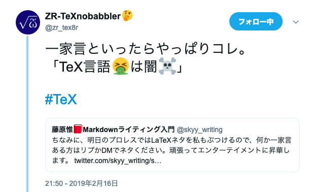

# Q: 私は誰？

- [藤原惟（skyy_writing）](https://twitter.com/skyy_writing)
- 『Markdownライティング入門』（インプレスR&D）の人
- 日本Pandocユーザ会の人

{width=70%}

---

# 「Markdownで同人誌」の闇

- 技術書典4で「Pandoc + LuaLaTeX」
    - LaTeXの知識が必須
    - 人類一般にはまだ早い？（これから頑張ります）
- 今日は割愛します
    - 以前に記事にまとめたので読んでください
    - [「技術同人誌をMarkdownで書く」とは、実際どういうことか？｜藤原 惟](https://note.solarsolfa.net/n/n697389a6be3b)

---

# Q: この本はMarkdownで書いた？

- Yes. ただし……
    - 同人誌版：「Pandoc's MarkdownにLaTeX 命令を埋め込んだやつ」
    - 商業誌版：版元の指示に従い、Pandocで上記をWordに変換
- したがって、LaTeX 芸です

{width=70%}

---

# Q: このスライドはどうやってビルドした？

```
$ pandoc slide.md -t beamer --pdf-engine=xelatex \
    -H header.tex -o slide.pdf
```

- Pandoc 2.6
- XeLaTeX (TeX Live 2018)
    - LaTeX Beamer (スライドつくるやつ)
    - `header.tex` で、若干カスタマイズ

---

# 今日話したいこと

\Large

## TeX はなぜ辛いか

---



---


---

# Q: さっきの人は誰？

- [ZR-TeXnobabblerさん (zr_tex8r) ](https://twitter.com/zr_tex8r)
- ~~TeX 芸人~~ TeX の日本語エコシステムをすごい勢いで開発してる人

---

# トピック

\Large

## pLaTeX でヒラギノ使わせろ！問題

---

# LaTeX のフォント周りが難しい理由

[golden-luckyの日記 2018-12-09](https://golden-lucky.hatenablog.com/entry/2018/12/09/180038) [^shikano]

1. TeXのフォント環境の理解は難しい
   - フォントに関する深い知見はもちろん、今となっては古臭いTeXのディレクトリに関する知識も必要
2. TeX Liveが現代的なインターフェースでラップしてくれている
    - なので、我々は古臭いTeXの知識がなくても日本語PDFが作れる
3. 古臭い設計を捨て、現代的なOSのフォント環境で動かすことを前提に開発されている新しいTeXもある
    - XeTeX、LuaTeX（後述）

[^shikano]: ラムダノート株式会社の鹿野桂一郎さん

---

# macOSのヒラギノ対応が難しい理由

[golden-luckyの日記 2018-12-09](https://golden-lucky.hatenablog.com/entry/2018/12/09/180038)

- かつてAppleのOS上のTeXで利用することが流行し、現在ではAppleによって古いTeXから見にいくのが困難な状態にされてしまったヒラギノ
    - それを引き続きmacOSで使えるようにするパッチも、TeX Liveの本体とは別に毎度作られている
- いろいろな事情や思惑があって大々的には配布されていないようだけど……
    - OSSなので、プロプラなシステムに対応するためのパッチをどういう形で公開するかに文句はいえないと思う

---

# 比較的新しいLaTeX処理系: pdfTeXとXeTeX

以下すべて、DVIではなく**PDFを直接出力する**

- pdfTeX
    - 欧米圏のデファクトスタンダード
    - 日本語組版が残念
- XeTeX（じーてっく、じーてふ）
    - 多言語対応に強い（アラビア語とか）
    - 中国・韓国で人気らしい
    - 日本語組版もまあまあいける（要・zxjatype/BXjsclsなど）

---

# 比較的新しいLaTeX処理系: LuaTeX

- LuaTeX（るーあてっく、るーあてふ）
    - pdfTeXの後継で、文字通りLuaで拡張できる（！）
    - 実用的なTeX処理系の中で、最もモダンな設計（だと思う）
    - 日本語向け [LuaTeX-ja](https://ja.osdn.net/projects/luatex-ja/wiki/LuaTeX-jaの使い方) の完成度は高い
- おまけ: [BXjsclsパッケージ](https://texwiki.texjp.org/?BXjscls)
    - pdf/Xe/LuaTeXで、新ドキュメントクラス（jsarticleなど）相当を動かせるすごい文書クラス集

---

# Re:VIEWでLuaTeX

- `review-jlreq` クラスファイルの導入（開発段階）
    - LuaTeX対応
    - jlreqとは: [日本語組版処理の要件](https://www.w3.org/TR/jlreq/ja/)
        - より「正しい」日本語組版を再現できる（ことを目指している）
    - [Re:VIEW 3 からの LaTeX 処理 — Re:VIEW knowledge ドキュメント](https://review-knowledge-ja.readthedocs.io/ja/latest/latex/review3-latex.html)
    - 別途 jlreq クラスファイルの GitHub から展開するなどしてインストールする必要あり

---

# LaTeXを拡張するのに、TeX言語は不要！？

- expl3: 人間に優しめのLaTeX用プログラミング言語
    - [TeX 言語者のための expl3 入門 | ラング・ラグー](https://blog.wtsnjp.com/2018/04/28/expl3-for-tex-users/)
- Lua (LuaTeX専用)
    - [思わず Lua で LaTeX してみた ～LuaTeX で日本語しない件について～](http://zrbabbler.sp.land.to/lualatexlua.html)

---

# 組版界に降り立つ希望の星：SATySFi

- [gfngfn/SATySFi](https://github.com/gfngfn/SATySFi/blob/master/README-ja.md)
- TeX/LaTeXに一切依存せず、ゼロから設計・実装された組版システム
- 最大の特徴：関数型言語・型システムの恩恵を受けられる
    - エラーがめっちゃしっかりしている
- 横書きの技術同人誌（メジャーな数式入り）なら、普通に無難に出力できるクオリティ
- 実際にSATySFiで組まれた本
    - [The SATySFi​book（Web公開版 第1版） - gfnbooth - BOOTH](https://gfngfn.booth.pm/items/1127224)

---

# その他の辛みの理由をつらつらと

---

# 理由1: TeX Liveのエコシステムが巨大で複雑

- TeX Liveというディストリビューション
    - TeX に必要なものすべて揃う（`scheme-full` でインストール）
    - ただし、数GBを普通に食う
    - なぜか？：PDFドキュメントが占領してる（理由後で）

---

# TeX Liveの闇

- [TeX Live をホンキで語る ― 「TeX Live ってなんだろう？」 - Acetaminophen’s diary](http://acetaminophen.hatenablog.com/entry/texadvent2016-20161205)
- TeX Users Group がそれらのソースやパッケージを一箇所に集め、一気にインストールできるようにすることを目指した
- でかすぎて、**全体を俯瞰することがほとんど不可能**

---

# パッケージマネージャ `tlmgr` の闇

- **全てを管理してるわけではない**
- tlmgr の「パッケージ」と LaTeX の「パッケージ」は違う
- **依存関係を完全には解決できない**

---

# 日本人（または日本在住・日本語話者）のTeX Live貢献者

- 角藤亮さん（Windows環境に TeX を移植、W32TeX のメンテナ）
    - この人が倒れたら、世界中の誰もWindowsでTeX をビルドできない説
- 田中琢爾さん（pTeX の内部処理を Unicode 化した upTeX の開発者）
- Norbert Preining さん（Debian 向けの TeX Live パッケージのメンテナ）
- アセトアミノフェンさん（「TeX Live チーム」として活動）

---

# お役立ち情報: TeX Liveの「正しい」インストール方法

- 奥村先生・黒木先生の『[LaTeX2e 美文書作成入門](http://www.amazon.co.jp/dp/B01NAW5V3E/)』付属DVDから
- macOS（あんまり考えたくない人）：MacTeX
- Windows: [TeXインストーラ3](https://www.ms.u-tokyo.ac.jp/~abenori/soft/abtexinst.html)
- 本当に正式なやり方: `install-tl` を使う
    - パッケージマネージャは `tlmgr` 
- ソースコードとドキュメント抜き
    - [インストーラープロファイルを用いてTeX Liveをインストールしよう - Qiita](https://qiita.com/munepi/items/f2eaa30f0cd00a9a68f8)

---

# 理由2: TeX は基本、レガシー重視

- 出版社などにある大量のレガシー原稿を、いつでも再現できる必要がある
    - 古のsty/clsファイルも、出版社や学会の数だけある？
- 古いソースコードとドキュメントは、**ビルド環境とセットで保管する**文化
    - TeXLiveは、ドキュメントをローカルに全部保存するのがデフォルト
- 例外
    - \LuaTeX ([開発方針でややこしい話も](http://acetaminophen.hatenablog.com/entry/2018/12/09/171231))
    - ZRさんなどが開発してるパッケージ群

---

# 理由3: TeX コミュニティのマンパワーが足りてない

- 現代のTeX はボランティアベースのOSS開発
    - 昔はアスキーとかNTTとかが頑張ってた時代も
- びっくりするぐらいカツカツで運営してる
    - キーパーソンが一人でも倒れたら、日本どころか世界中のTeX ユーザが混乱に陥る
    - ちょっとでもTeX Liveに変更が出てきたら、各方面からイチャモンが出てくるので対処せざるを得ない

---

# エピソード: アセトアミノフェンさん

- 「TeX Liveチーム」として活動
- [私と TeX Live と LuaTeX の近況レポート - Acetaminophen’s diary](http://acetaminophen.hatenablog.com/entry/2018/12/09/171231)
- 毎朝一回，お出かけ前に必ずやること（！）
    - TeX Live の subversion をチェック
    - W32TeX の ChangeLog をチェック
    - TeX Live 関連のメーリスの配信を読む
    - GitHubのAll activityを見る
- 暇を見つけて、Twitter で TeX Live 関連，W32TeX 関連のツイートを見る
- 何か気になる変更があったら，帰宅後にソースをpull
    - 気になる変更があったら，ビルドして試す（！）

---

# TeX Wikiは、公式ではない

- 元々は奥村先生（美文書入門）のWikiを移転した
    - 移転してからは、「誰でも自由に書ける」状態
- クオリティが担保できない問題
    - TeXコミュニティの誰もが知らない筆者が加筆してたらしい（！？）
    - 情報がバラバラになってる
- 例の事件があってから、TeX コミュニティで議論してます

---

# 信頼できる情報源

- ZRさんのブログ
    - [マクロツイーター](https://zrbabbler.hatenablog.com/)
    - [En toi Pythmeni tes TeXnopoleos 電脳世界の奥底にて](http://zrbabbler.sp.land.to/)
- アセトアミノフェンさんのブログ
    - [Acetaminophen’s diary](http://acetaminophen.hatenablog.com/)

---

# お役立ち情報: texdoc

- ローカルに保存しているTeX LiveのPDFマニュアルを一発で呼び出せるコマンド
- `$ texdoc (パッケージ名)`
    - 例: `$ texdoc bxjscls`

---

# TeX Conf 2018 at 北海道大学

- [TeXConf 2018](https://texconf2018.tumblr.com/post/178006393216/third-announcement#timetable)
- [『日本語の LaTeX で幸せになる，かもしれない方法』](https://t.umblr.com/redirect?z=https%3A%2F%2Faminophen.github.io%2Fslide%2Fhytexconf18.pdf&t=ZjUyM2U0MzVhYjZlNDEwOWJlZjFlMzBiMDZmMjFjNDI2NjBiNDUxOCxsNXdDZUZ1Rw%3D%3D&b=t%3AMFbJWSINgEvj_8MhCYnQPg&p=https%3A%2F%2Ftexconf2018.tumblr.com%2Fpost%2F178006393216%2Fthird-announcement&m=1)

---
