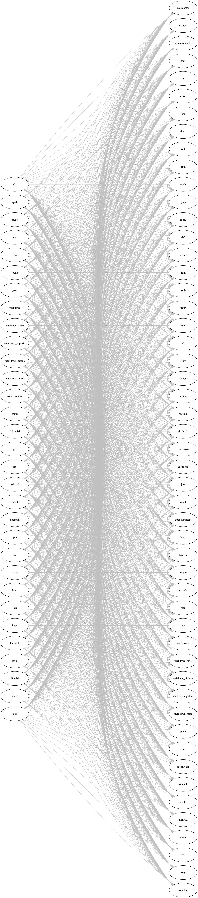

# Pandoc Night 2019 へようこそ！

- 18:30 開場
- 19:00 開始予定

---

# タイムスケジュール

| 時刻（目安） | 内容・LTタイトル	| 発表者	|
|----------	|--------	|----------	|
| 18:30          | 開場       	|          	|
| 19:00          | 開始・概要説明（＋会場提供の紹介）  	| 藤原惟         	|
| 19:15          | LT枠1 「私のPandoc遍歴」        	| `@setoazusa` |
| 19:30          | LT枠2 「RMarkdownからWordを生成する闇の技術プラスアルファな感じ（未定）」        	| `@niszet0` |
| 20:00          | 休憩（歓談タイム）       	|          	|

---

# タイムスケジュール

| 時刻（目安） | 内容・LTタイトル	| 発表者	|
|----------	|--------	|----------	|
| 20:15          | LT枠3 「私的Markdown−PDF変換環境を紹介するLT」         	| `@_K4ZUKI_` |
| 20:30          | LT枠4 【藤原がLT or 飛び入り歓迎】      	|          	|
| 20:45          | クロージング       | 藤原惟         	|
| 21:00          | 一旦終了（以後、歓談タイム） |  |
| 22:00          | 撤収（目安）       	|          	|

---

# 注意事項

- 飲食可能（ビアバッシュします！）
- お片付けなど、ご協力いただければ幸いです！
- **営業・採用活動に関する勧誘などの行為はお断りします**

---

# Pandocとは？

- a universal document converter
    - 万能文書変換器
    - 文書変換ツール
- ある文書（ドキュメント）を入力フォーマット $A$ から 出力フォーマット $B$ に変換する
    - コンテンツ（内容）とメタデータは**可能な限り**残す
    - スタイルはバッサリ捨てて、フォーマット $B$ に合わせる

---

{.streach}

---

{.streach}

---

# 公式トップページ：例の図

<https://pandoc.org/>

{.stretch}

---

# トップページ：対応フォーマット一覧（最近できた）

{.stretch}

---

# 対応フォーマット：軽量／マークアップ言語

```
↔ Markdown (including CommonMark and GitHub-flavored Markdown)
↔ reStructuredText
→ AsciiDoc
↔ Emacs Org-Mode
→ Textile
↔ MediaWiki markup
```

---

# 対応フォーマット：HTML/XML系

```
↔ (X)HTML 4
↔ HTML5
↔ DocBook version 4 or 5
↔ OPML
→ OpenDocument XML
```

---

# 対応フォーマット：ワープロ・組版・電書系

```
↔ Microsoft Word docx
↔ OpenOffice/LibreOffice ODT
↔ LaTeX
→ InDesign ICML
↔ EPUB version 2 or 3
```

---

# 対応フォーマット：プレゼンスライド

```
→ LaTeX Beamer
→ reveal.js
```

---

# 対応フォーマット：新しいもの（要注目！）

```
→ Microsoft PowerPoint
↔ Jupyter notebook (ipynb)
```

---

# Pandocは「銀の弾丸」か・・・？


---

# Enjoy Pandoc!

- わからないことは質問してください！

---

# Pandocユーザ会について

---

# Pandocユーザ会とは

- 今のところ任意団体のユーザ会です
- 目的
    - Pandocに関する情報共有・ヘルプ
    - Pandocが対応する**各種文書フォーマットを知り、そのユーザと交流する**
- ユーザ層はかなり多様です
    - LaTeX、Word、Sphinx、LibreOffice、Rなどなど
    - ITエンジニアだけでなく、編集者や非IT系エンジニア（電機系？）も

---

# Pandocユーザ会の活動拠点

- メーリングリスト
    - たまに更新、今後も使います
- Slack
    - アクティブですが、きちんと宣伝してませんでした :bow:
    - 参加希望の方は藤原まで話しかけてください！
- Webサイト
    - 長らく放置して申し訳ありません :bow:
    - ユーザーズガイド日本語版と同時にリニューアル（ベータ版で公開予定）

---

# Pandocユーザ会Slackにぜひ！


<http://bit.ly/pandoc-jp>

---

# Pandocユーザーズガイド 日本語訳の改訂作業

---

# 日本語訳 前のバージョン：1.12.4.2（超古い）

<http://sky-y.github.io/site-pandoc-jp/users-guide/>


---

# 日本語訳 改訂版：2.7+に対応予定

- <https://pandoc-doc-ja.readthedocs.io/ja/latest/users-guide.html>
    - robots.txtで検索避け中（まもなく公開予定）


---

# 翻訳者・レビュワー募集中！

- Slack または 藤原にお声がけください


---

# Pandocの深層へようこそ・・・

---

# Pandocが扱える文書表現

- 実は「文書」の内部表現がPandocに存在する
    - [jgm/pandoc-types: Definition.hs](https://github.com/jgm/pandoc-types/blob/master/Text/Pandoc/Definition.hs)で定義されている
- Haskell: `data Pandoc = Pandoc Meta [Block]`
    - `Pandoc`というデータ型がある
    - `Meta`: メタデータ
    - `[Block]`: ブロック（`<div>`や`<p>`などに相当）のリスト
        - ブロックの種類によっては、インライン `Inline` を含むこともできる
- **この制約が実はキツイ！**

---

# Pandocをユーザが拡張する方法

- フィルタ：自分でコードを書いてカスタマイズできる
- テンプレート：コンテンツを流し込んで出力ファイルを得る元のテンプレート
- Reference Doc

---

# フィルタ

- 自分でコードを書いてカスタマイズできる
- オプション: `-F` or `--filter`
- JSONフィルタ：任意のプログラミング言語で書かれた実行可能ファイル
- Luaフィルタ：Pandocバイナリが持っているLua処理系を用いたフィルタ
    - :o: 早い、外部プログラムに依存しない
    - :x: Luaの学習コスト、デバッグにコツが必要

---


---

# テンプレート

- コンテンツを流し込んで出力ファイルを得る元のテンプレート
- オプション: `--template`
- 迷ったら `pandoc -D フォーマット名` でテンプレートを直接読もう！
- Pandocのデフォルトテンプレート ([pandoc-templates](https://github.com/jgm/pandoc-templates)) をForkし拡張するのがおすすめ
    - バージョンごとにアグレッシブに変わるため

---

# 補足：メタデータとテンプレート変数

|  | メタデータ	| テンプレート変数	|
|----------	|--------	|----------	|
| 出力ファイルのメタデータとして出力 | :o: | :x: |
| テンプレートに変数埋め込み | :o: | :o: |
| オプション | `-M key=val` | `-V key=val` |
| YAMLメタデータブロック | :o: | :x: |

---

# Reference Doc

- Wordなどテキストで表現しにくい文書について、具体的なファイル (docxなど) をテンプレートの代わりにする
    - `--refernce-doc` (注意：以前は `--refence-docx` だった！)
- Haskellを書いて [jgm/pandoc](https://github.com/jgm/pandoc) に直接コントリビュートする！

---

# カスタムWriter

- 出力ファイルを担当するモジュール（Writer）をユーザがLuaで書ける
- 基本のLuaソースがあるので、これを流用して書いてもいい
    - [pandoc/sample.lua](https://github.com/jgm/pandoc/blob/master/data/sample.lua)

