# 自己紹介

- 藤原 惟 (\@sky\_y)
- フリーエンジニア・ライター
- 著書『Markdownライティング入門』（インプレスR&D）
- 日本Pandocユーザ会 代表
    - Pandocユーザーズガイド翻訳（後述）
    - OSPN Pressに寄稿
    - 初のユーザイベント「Pandoc Night」開催（2019/5/20 @ 東京）

---

# 今日お話しする内容

- ドキュメント翻訳を支える技術
    - 目的：[Pandoc User's Guide](https://pandoc.org/MANUAL.html)（英文）を翻訳しユーザが見られるようにする
    - いくつかの課題がある

---

# Pandocとは？

- a universal document converter
    - 万能文書変換器
    - 文書変換ツール
- ある文書（ドキュメント）を入力フォーマット $A$ から 出力フォーマット $B$ に変換する
    - コンテンツ（内容）とメタデータは**可能な限り**残す
    - スタイルはバッサリ捨てて、フォーマット $B$ に合わせる
- オープンソースソフトウェア (GPL v2 or later)

---

# OSPN Pressの記事

- [「オープンソース」を使ってみよう（第47回 Pandoc）](https://www.ospn.jp/press/20170705no52-useit-oss.html)

---

{.streach}

---

{.streach}

---

# 公式トップページ：例の図

<https://pandoc.org/>

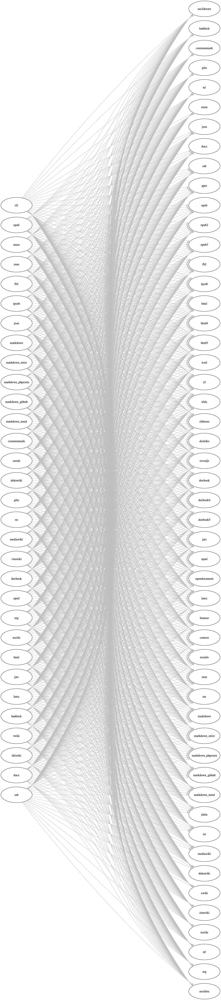{.stretch}

---

# トップページ：対応フォーマット一覧（最近できた）

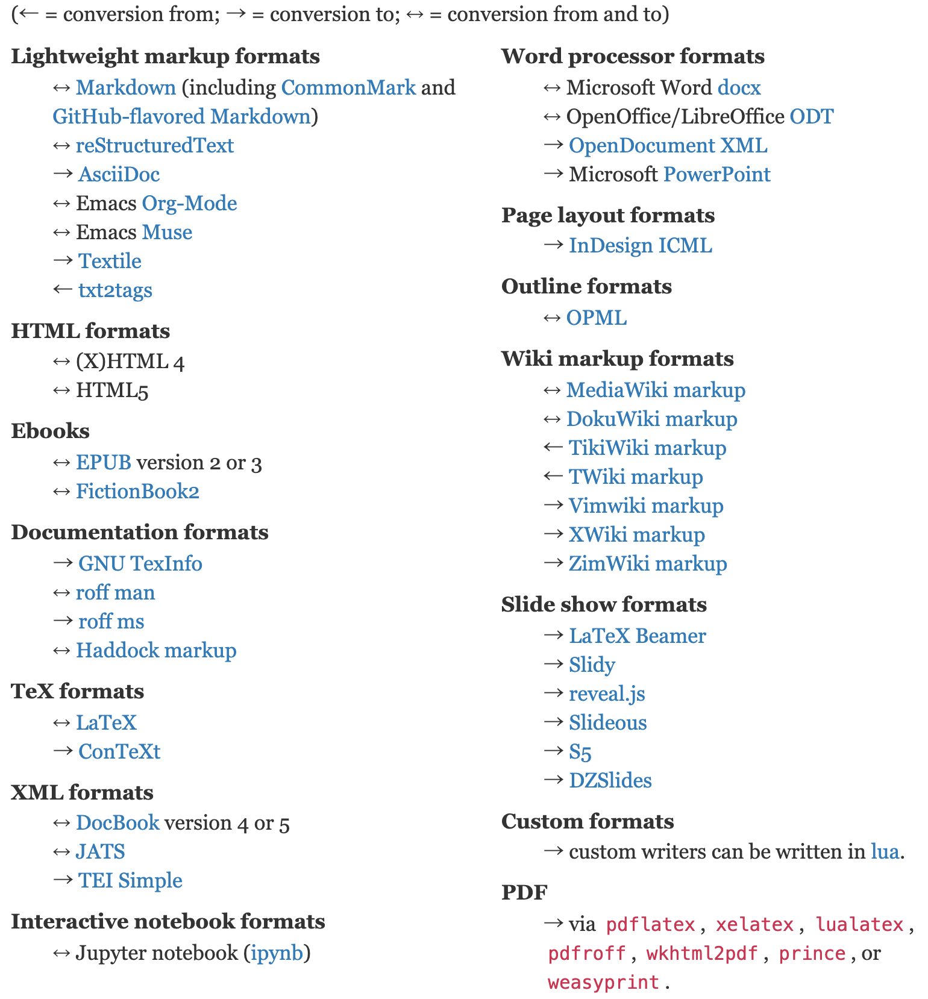{.stretch}

---

# 代表的な対応フォーマット

- 軽量/Wikiマークアップ言語
    - ↔︎ Markdown (GFM, CommonMarkなど各種方言に対応)
    - ↔︎ reStructuredTextなど
    - ↔︎ MediaWiki markup
- ↔︎ HTML, EPUB, LaTeX
- オフィス系
    - ↔︎ Microsoft Word docx
    - ↔︎ OpenOffice/LibreOffice ODT
- → スライド (LaTeX Beamer, reveal.jsなど)

---

# ここ最近で対応したフォーマット

```
→ Microsoft PowerPoint
↔ Jupyter notebook (ipynb)
→ Jira wiki markup
```

---

# Pandocユーザ会について

---

# Pandocユーザ会とは

- 今のところ任意団体のユーザ会です
- 目的
    - Pandocに関する情報共有・ヘルプ
    - Pandocが対応する**各種文書フォーマットを知り、そのユーザと交流する**
- ユーザ層はかなり多様です
    - LaTeX、Word、Sphinx、LibreOffice、Rなどなど
    - ITエンジニアだけでなく、編集者や非IT系エンジニア（電機系？）も

---

# Pandocユーザ会の活動拠点

- メーリングリスト
    - たまに更新、今後も使います
- Slack
    - アクティブですが、きちんと宣伝してませんでした :bow:
    - 参加希望の方は藤原まで話しかけてください！
- Webサイト
    - 長らく放置して申し訳ありません :bow:
    - ユーザーズガイド日本語版と同時にリニューアル（ベータ版で公開予定）

---

# Pandocユーザーズガイド 日本語訳の改訂作業

---

# 日本語訳 前のバージョン：1.12.4.2（超古い）

<http://sky-y.github.io/site-pandoc-jp/users-guide/>

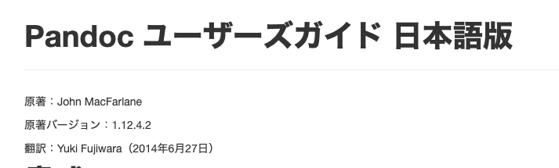


---

# 日本語訳 改訂版：2.7+に対応予定

- <https://pandoc-doc-ja.readthedocs.io/ja/latest/users-guide.html>
    - robots.txtで検索避け中（まもなく公開予定）

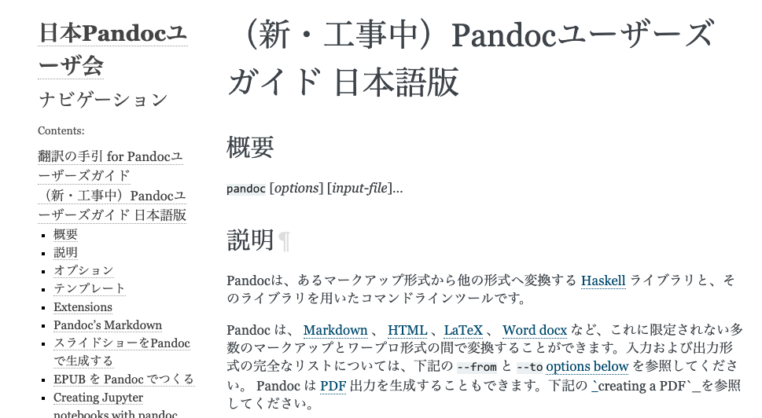

---

# 前回の反省とこれからの課題

- 前回：1人で全部訳した
    - 持続可能でない (藤原が辛い)
    - 共同作業の仕組みがなかった
- gettextや翻訳メモリなど、翻訳ツールを使わなかった
    - テキストエディタ上で直接英文を和訳していた
    - 非効率的
- Pandocのバージョンが頻繁に上がる (1～3ヶ月に1度ぐらい)
    - User's Guide原文も頻繁に書き換わる
    - 和訳も素早く追随する必要がある

---

# 改訂版・Pandocユーザーズガイド

- 作業中・未完成のものです
- <https://pandoc-doc-ja.readthedocs.io/ja/latest/>
- GitHub: [pandoc-jp/pandoc-doc-ja](https://github.com/pandoc-jp/pandoc-doc-ja)

---

# 改訂版ユーザーズガイドのシステム構成

---

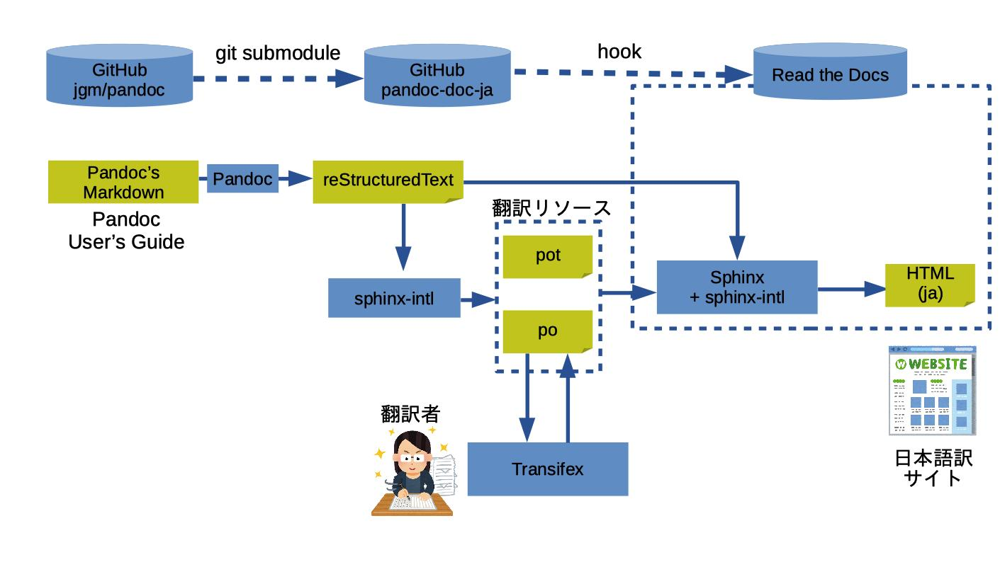{.stretch}

---

# GitHub (jgm/pandoc): User's Guide原文 

- [jgm/pandoc](https://github.com/jgm/pandoc): Pandoc本体のリポジトリ
- [MANUAL.txt](https://github.com/jgm/pandoc/blob/master/MANUAL.txt)
    - Pandoc User's Guideの原稿となるMarkdown文書
- **Pandoc's MarkdownというMarkdown方言で書かれている**
    - → Pandocで変換するしかない

---

# MANUAL.txtを翻訳・Webサイト生成したいが……

- Pandocの出力は原則1ファイル
    - 複数ページのWebサイトを構築するためには、別のツールの助けが必要
- Markdownを翻訳する手段: [po4a](https://po4a.org/index.php.ja)
    - gettextが想定しないドキュメントでの翻訳が目標
    - 情報源が少ないので、今回は見送り（future work）

---

# そうだ、Sphinxを使おう！

- Sphinx: ドキュメントビルダー
    - sphinx-intl: gettextベースの翻訳ユーティリティ
    - 情報源・実績・エコシステムが豊富
    - **ただし reStructuredText (reST) が前提**
- 最大の採用理由：Pandocユーザ会のメンバーにSphinxメンテナがいらっしゃる！
    - 小宮さん (`@tk0miya`)

---

# 今回のプロジェクトでの判断

- Sphinx + sphinx-intl を採用
- MANUAL.txt (Pandoc's Markdown) を reST に変換する
    - ここでPandocが活躍！（ただし1行でおわり）
- Read the Docs でビルド（CI）＆ホスティング
    - Sphinxを公式サポート → 気軽に導入できる
    - GitHubリポジトリから自動的にビルド

---

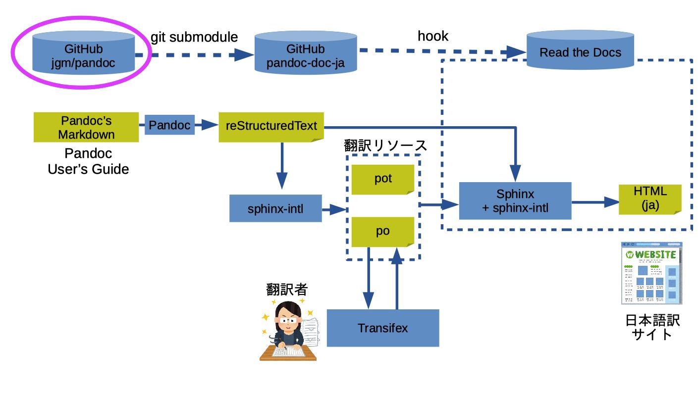{.stretch}

---

# jgm/pandoc から MANUAL.txt を取得する

- git submodule を利用して、リポジトリを同期
    - MANUAL.txtを特定バージョン (tag) に固定できる
    - 例: `2.7.2`
- 参考: [Git submodule の基礎 - Qiita](https://qiita.com/sotarok/items/0d525e568a6088f6f6bb)

---

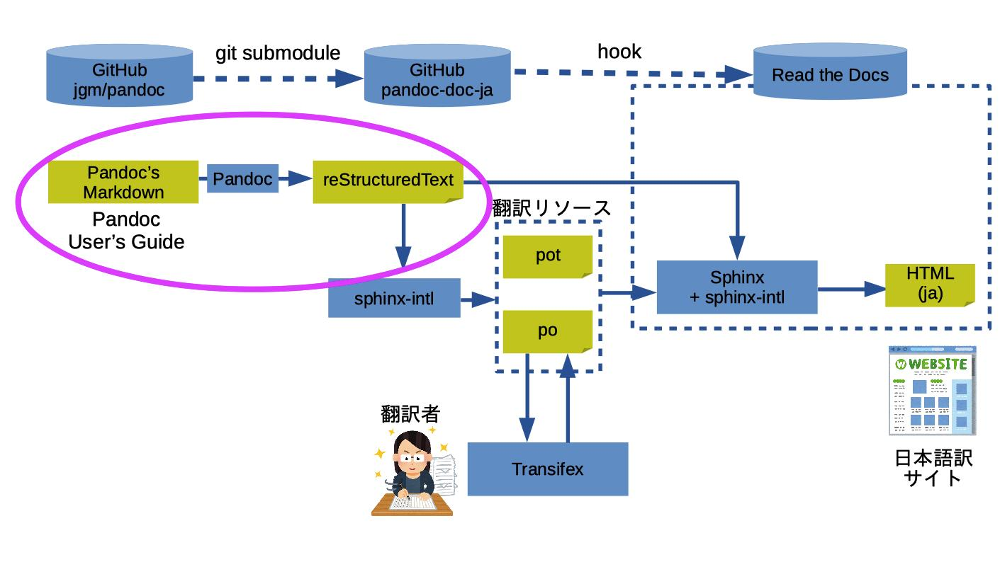{.stretch}

---

# Pandoc: Markdown -> reStructuredText

```
$ pandoc -f markdown -t rst MANUAL.txt -o users-guide.rst
```

- `-f markdown`: 入力形式はPandoc's Markdown
- `-t rst`: 出力形式はreStructuredText
- `-o` 出力ファイル
- 実際にはMakefileに書いている

---

# Markdown と reStructuredText の違い

- Markdown
    - Web業界で大人気（それ以外ではあんまり知られてない）
    - 元々はHTML出力が目的（今は広がっている）
    - 記法の記述能力：弱い
    - 「Markdown方言」問題
- reStructuredText (reST) 
    - 記法の記述能力：高い
    - ドキュメンテーション用途を想定している
    - Sphinxの標準記法（Python界では知られている？）

---


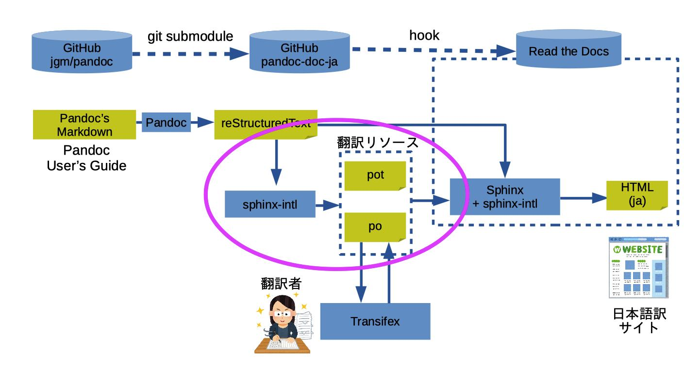{.stretch}

---

# sphinx-intl: 翻訳ファイル生成 (pot/po)

- [国際化 — Sphinx 3.0.0+/d6dff753 ドキュメント](http://www.sphinx-doc.org/ja/master/usage/advanced/intl.html)
- Sphinx用翻訳ユーティリティ（gettextを内部で用いている）

```
# potファイル作成
$ make gettext

# poファイル作成
$ sphinx-intl update -p _build/gettext -l ja  # 
```

---

# sphinx-intl (gettext) の仕組み


[国際化 — Sphinx 3.0.0+/d6dff753 ドキュメント](http://www.sphinx-doc.org/ja/master/usage/advanced/intl.html)

---


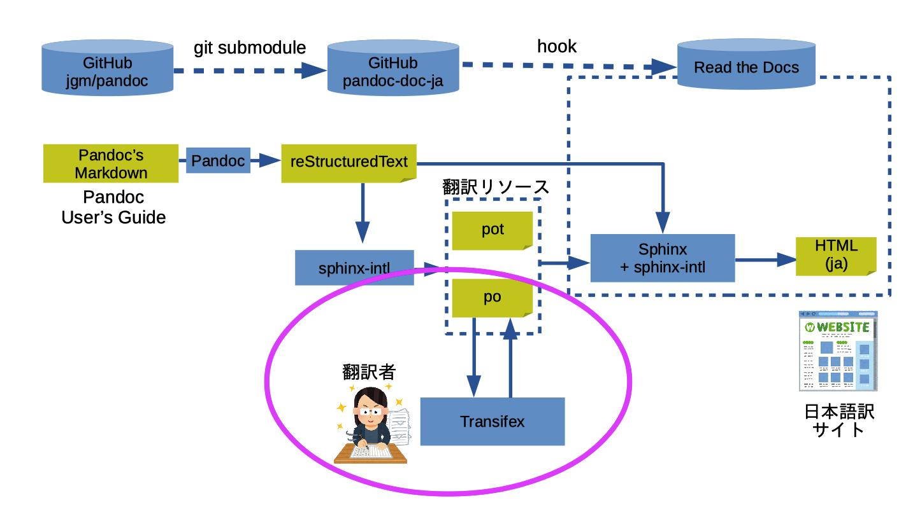{.stretch}

---

# Transifex: 翻訳作業用のWebアプリ

- Webベースで翻訳作業 → poファイル生成ができる
- OSSプロジェクトは無料で利用可能（要登録）
- 複数ユーザで翻訳作業が可能
- Sphinxとも相性が良い（専用ユーティリティツールが存在）

---

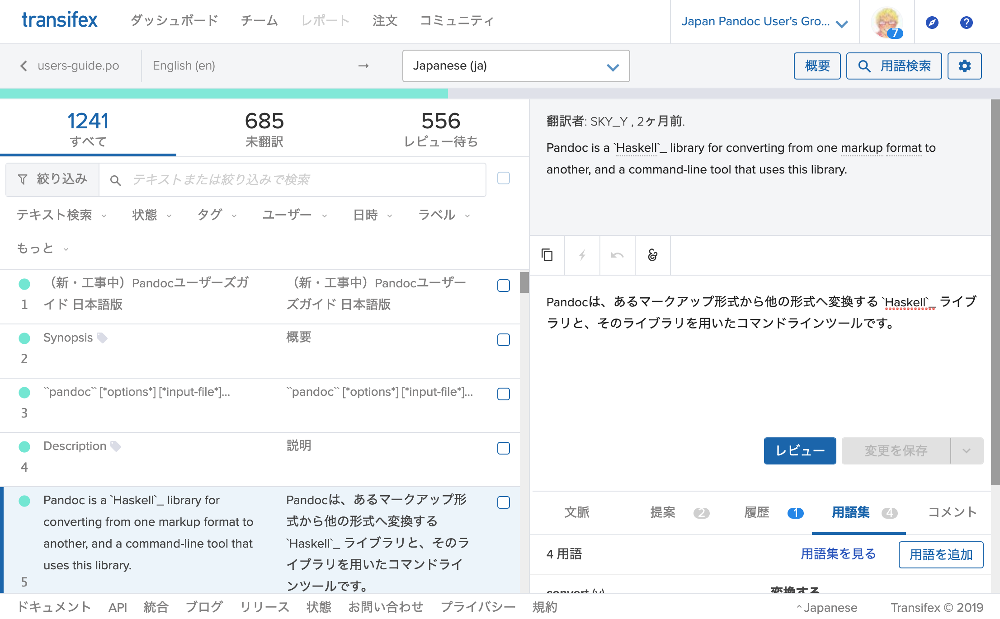

---

# 翻訳からビルドまでの流れ

1. Sphinx(-intl) でpoファイルを生成
2. poファイルをTransifexにアップロード
3. Transifex（Webブラウザ上）でひたすら翻訳する
4. 翻訳済poファイルをダウンロードする
5. Sphinx(-intl) でHTMLをビルド

---

# デモ：Transifex上での翻訳


---

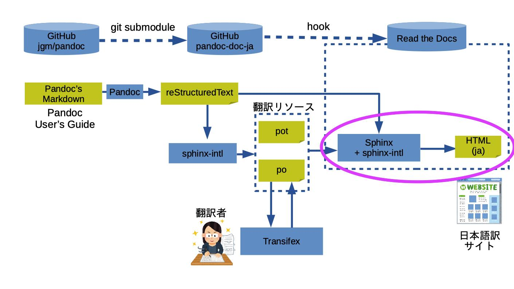{.stretch}

---

# Sphinx: HTMLを生成

- 基本的には `make html` でビルド
- sphinx-intl用に `-D language='ja'` のオプションを追加

```
$ make -e SPHINXOPTS="-D language='ja'" html
```

---

{.stretch}

---

# Read the Docs: CI & ホスティング

[Read the Docs](https://readthedocs.org/)

- ドキュメントのホスティングサイト
    - オープンソース向けは無料でホスティング可能
- ドキュメントビルダーは Sphinx と MkDocs (Markdown向け) に対応
- GitHubのpushを検出するhook → 自動ビルド
- そのまま公開できる

---

# 改訂版・Pandocユーザーズガイド

- 作業中・未完成のものです
- <https://pandoc-doc-ja.readthedocs.io/ja/latest/>
- GitHub: [pandoc-jp/pandoc-doc-ja](https://github.com/pandoc-jp/pandoc-doc-ja)

---

# 失敗談・議論・今後の課題

---

# 失敗談：ロケール設定をミスった (1)

- 言語設定は `ja` (日本語)
    - `ja_JP` (日本語・日本) はRead the Docsで対応していない（！）
    - 最初、後者の設定にしていたため、あとで`ja_JP` から `ja` に諸々データを移植した

```
$ sphinx-intl update -p _build/gettext -l ja     # Good
$ sphinx-intl update -p _build/gettext -l ja_JP  # Bad
```

---

# 失敗談：ロケール設定をミスった (2)

- 結果として、**Transifex（後述）の翻訳メタデータを飛ばした（泣）**
    - 翻訳結果は残ったが、「誰がいつ翻訳したか」が分からなくなった

---

# 議論：機械翻訳の可否

- オープンソースプロジェクトに、**一切**機械翻訳を導入すべきでない？
    - 「Ubuntu機械翻訳おじさん」事件
    - [Ubuntu英日翻訳にGoogle翻訳の成果物を突っ込む人物が現れライセンスがなんじゃもんじゃでつらい - Togetter](https://togetter.com/li/1084225)
- ライセンス違反は論外として……
- Q「読者がドキュメントを読んで、機械翻訳かどうか判別できるか？」

---

# 藤原の見解

- 「翻訳プロジェクトの責任者が、翻訳責任を持つ」
    - 責任者は、ライセンス違反になるような機械翻訳を排除する責任がある
    - 責任を取るのが人間の最後の仕事
    - （実務上は、機械翻訳されたものを厳密に100%排除するのは原理上無理では？）
- 本プロジェクトでの周知事項
    - **参考として**機械翻訳を利用することは差し支えない
    - **最終的には、自力で翻訳すること**

---

# 今後の課題 (1)

- モチベーション管理
    - 藤原自身と、翻訳チームメンバー
    - 停滞気味なので、うまく進む仕掛けを仕込みたい
- 本当の意味で継続的インテグレーション(CI)を実現したい
    - まだ藤原が手作業でやっている部分も多い
    - 特にTransifex（poファイル）まわりは手動
    - Pandocのバージョンアップ追随には必須

---

# 今後の課題 (2)

- 翻訳の品質向上
    - 用語集・翻訳メモリなどがうまく使えていない
    - 「良い翻訳」のノウハウが不足している

---

# 紹介：ドキュメンテーションの世界的なコミュニティ

[Write the Docs](https://www.writethedocs.org/)

- カンファレンス・ミートアップ
    - 2019: 米ポートランド、リトアニア、チェコ、オーストラリア
- 学習リソース
- Slack・情報共有
- 仕事紹介

---

# 最後に：翻訳者・レビュワー募集中！

- Slack または 藤原にお声がけください


---

# Pandocユーザ会Slackにお越しください！


<http://bit.ly/pandoc-jp>

---

# おまけ：この発表スライドを支える技術

- Pandoc
- reveal.js: HTMLスライド

```
$ pandoc index.md -f markdown -t revealjs -o index.html -s -c custom.css 
```
